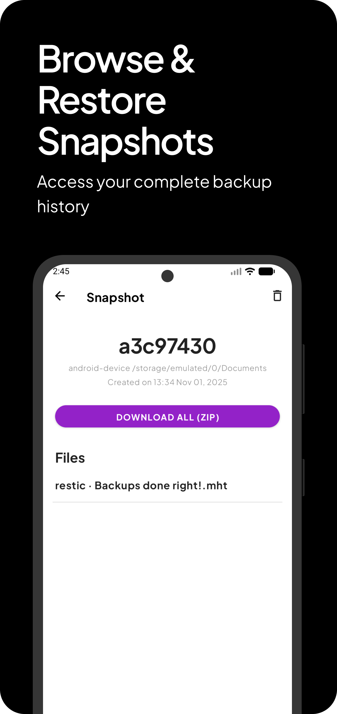

# Resticopia

 
 

## Screenshots

  
  
  
  
  

## About

A mobile Android application that enables efficient and straightforward data backups powered by [Restic](https://restic.net) backup software.

The application uses a custom-built [PRoot](https://codeberg.org/dawdyd/build-proot-android) environment (based on the [build-proot-android](https://github.com/green-green-avk/build-proot-android) project) to run native [Restic](https://restic.net) and [Rclone](https://rclone.org) binaries directly on Android devices.

### Disclaimer
This is an **unofficial** application and is not developed or endorsed by the official Restic project team.

## Key Capabilities
- Repository Management: Create and configure Restic repositories (supports S3, B2, Rest, Local, and Rclone protocols)
- Snapshot Control: Browse and manage your backup snapshots
- Folder Selection: Choose which directories to include in backups
- Automated Scheduling: Set up recurring backup tasks
- Retention Policies: Define cleanup rules for individual folders
- Live Progress: Monitor backup operations through system notifications
- Rclone Integration: Access 40+ cloud storage providers via Rclone backend

## Donate

### This Project
- All modifications and additions are also licensed under GNU General Public License v2.0
- See git commit history for detailed changes

### Original Work
- **Original Project**: [restic-android](https://github.com/lhns/restic-android) by [lhns](https://github.com/lhns)
- **Original License**: GNU General Public License v2.0

## Notice
See the file called NOTICE.

## License
This project uses the GNU General Public License, Version 2. See the file called LICENSE.
